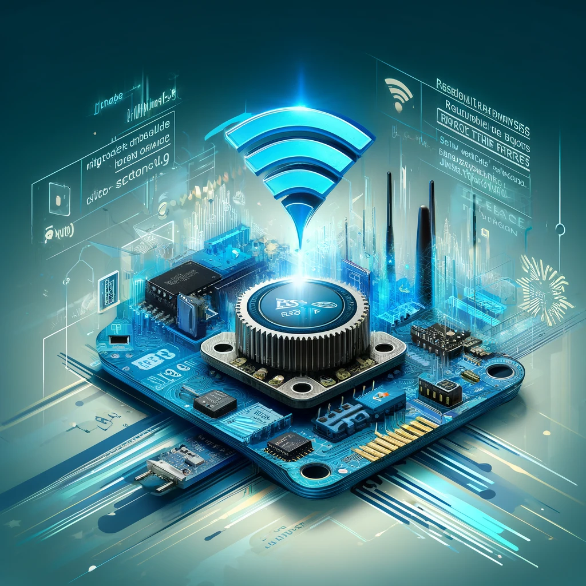
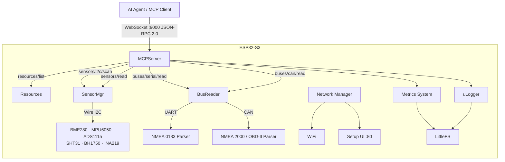

# ESP32 MCP Server

[](https://github.com/navado/ESP32MCPServer/actions/workflows/build.yml)

A [Model Context Protocol](https://modelcontextprotocol.io/) (MCP) server running on ESP32-S3, exposing real-world sensor data and bus protocols to AI assistants and automation tooling over WebSocket / JSON-RPC 2.0.

Connect an AI agent directly to your hardware: query I2C sensors, parse NMEA 0183 GPS/marine data, decode NMEA 2000 and OBD-II CAN frames — all through a standard MCP interface.



---

## Features

| Capability | Details |
|---|---|
| **MCP Protocol** | JSON-RPC 2.0 over WebSocket, resource discovery & subscriptions |
| **I2C Sensors** | Auto-scan + drivers for BME280, MPU6050, ADS1115, SHT31, BH1750, INA219 |
| **NMEA 0183** | GGA, RMC, VTG, GSV, MWV, DBT, DPT, HDG, HDT with XOR checksum validation |
| **NMEA 2000 / CAN** | 29-bit PGNs: position, heading, speed, depth, wind, attitude, water temp |
| **OBD-II / CAN** | Standard 11-bit OBD-II service 01 PID decoding |
| **Bus Readers** | Time-bounded serial and CAN reads, raw or parsed mode, JSON output |
| **WiFi** | AP setup UI + STA mode; credentials stored in LittleFS |
| **Metrics** | Heap, uptime, RSSI, histogram stats with boot persistence |
| **Testing** | 67 native unit tests (Unity), mock I2C / CAN / Serial / LittleFS |

---

## Architecture



---

## Hardware

### Bill of Materials

| # | Part | Purpose |
|---|---|---|
| 1 | ESP32-S3-DevKitC-1 | Main MCU |
| 1 | BME280 breakout | Temperature / Humidity / Pressure |
| 1 | MPU6050 breakout | 6-axis IMU (optional) |
| 1 | TJA1050 or SN65HVD230 | CAN bus transceiver (optional) |
| 1 | GPS module (3.3 V UART) | NMEA 0183 position/time (optional) |
| 2 | 4.7 kΩ resistors | I2C pull-ups |
| — | Breadboard + jumpers | |

### Pin Assignments

| GPIO | Function | Connected to |
|---|---|---|
| IO8 | I2C SDA | All I2C sensors |
| IO9 | I2C SCL | All I2C sensors |
| IO16 | UART1 RX | GPS / chart plotter TX |
| IO17 | UART1 TX | GPS / chart plotter RX (optional) |
| IO4 | CAN RX | TJA1050 / SN65HVD230 CRXD |
| IO5 | CAN TX | TJA1050 / SN65HVD230 CTXD |

### ESP32-S3-DevKitC-1 Wiring Overview

```
                    ┌──────────────────────────────────────┐
                    │         ESP32-S3-DevKitC-1            │
                    │                                       │
             3V3 ───┤ 3V3                          GND ├─── GND
             GND ───┤ GND                          IO0 ├
                    │                                   │
  I2C SDA ── IO8 ───┤ IO8  ┌──────────┐       IO17 ├─── UART1 TX → GPS
  I2C SCL ── IO9 ───┤ IO9  │  ESP32   │       IO16 ├─── UART1 RX ← GPS
                    │ IO10 │    S3    │       IO15 ├
                    │ IO11 └──────────┘       IO14 ├
                    │ IO12                    IO13 ├
                    │ IO3                      IO4 ├─── CAN RX ← TJA1050
                    │ IO46                     IO5 ├─── CAN TX → TJA1050
                    │                               │
                    │    USB (flash / serial log)   │
                    └───────────────────────────────┘
```

### I2C Sensor Wiring

All sensors share one bus. Add 4.7 kΩ pull-ups from SDA and SCL to 3V3.

```
ESP32-S3      BME280       MPU6050      ADS1115      INA219
─────────     ───────      ───────      ───────      ───────
IO8 (SDA)─────SDA──────────SDA──────────SDA──────────SDA
IO9 (SCL)─────SCL──────────SCL──────────SCL──────────SCL
3V3  ──────────VCC──────────VCC──────────VCC──────────VCC
GND  ──────────GND──────────GND──────────GND──────────GND
               SDO→GND      AD0→GND      ADDR→GND
               (0x76)       (0x68)       (0x48)       (0x40)
```

Other supported sensors (same bus wiring): **SHT31** (0x44), **BH1750** (0x23).

### NMEA 0183 Wiring (GPS / Chart Plotter)

```
GPS / chart plotter              ESP32-S3
───────────────────              ────────
TX  (3.3 V TTL NMEA out) ─────── IO16 (UART1 RX)
RX  (optional NMEA in)   ─────── IO17 (UART1 TX)
GND                      ─────── GND
VCC (3.3 V)              ─────── 3V3
```

> If the device outputs RS-232 levels, use a MAX3232 level shifter. Never connect RS-232 directly to ESP32 GPIO.

### CAN Bus Wiring (NMEA 2000 / OBD-II)

```
TJA1050 / SN65HVD230             ESP32-S3
────────────────────             ────────
CTXD                  ─────────── IO5 (CAN TX)
CRXD                  ─────────── IO4 (CAN RX)
VCC (5 V for TJA1050) ─────────── VIN / external 5 V
GND                   ─────────── GND
CANH ──────────────── NMEA 2000 backbone / OBD-II CANH
CANL ──────────────── NMEA 2000 backbone / OBD-II CANL
```

> NMEA 2000 runs at 250 kbps. OBD-II runs at 500 kbps. Set the baud rate in your `CANBusReader` configuration accordingly.

---

## Software Prerequisites

- [PlatformIO Core](https://docs.platformio.org/en/stable/core/index.html) CLI or the PlatformIO IDE plugin for VS Code
- Python 3.8+
- Git

```bash
pip install platformio
```

---

## Build & Flash

```bash
# 1. Clone
git clone https://github.com/navado/ESP32MCPServer.git
cd ESP32MCPServer

# 2. Install library dependencies
pio pkg install

# 3. Upload web assets to LittleFS (optional but recommended)
pio run -t uploadfs -e esp32-s3-devkitc-1

# 4. Build firmware
pio run -e esp32-s3-devkitc-1

# 5. Flash
pio run -t upload -e esp32-s3-devkitc-1

# 6. Monitor
pio device monitor --baud 115200
```

---

## First Run

1. Power on the board. It broadcasts a WiFi AP: **`ESP32_XXXXXX`** (last 6 hex digits of the MAC address).
2. Connect to that AP and open **`http://192.168.4.1`**.
3. Enter your WiFi credentials and click Save.
4. The board joins your network and prints its IP address on the serial console.
5. Connect an MCP client to **`ws://<IP>:9000`**.

---

## MCP API Reference

All methods use JSON-RPC 2.0 over WebSocket on port **9000**.

### Initialize

```json
{"jsonrpc":"2.0","method":"initialize","id":1}
```

### List resources

```json
{"jsonrpc":"2.0","method":"resources/list","id":2}
```

### Scan I2C bus

```json
{"jsonrpc":"2.0","method":"sensors/i2c/scan","id":3}
```

```json
{
  "jsonrpc":"2.0","id":3,
  "result":{
    "devices":[
      {"address":"0x76","type":"BME280","id":"bme280_76"},
      {"address":"0x68","type":"MPU6050","id":"mpu6050_68"}
    ]
  }
}
```

### Read a sensor

```json
{"jsonrpc":"2.0","method":"sensors/read","id":4,"params":{"sensorId":"bme280_76"}}
```

```json
{
  "jsonrpc":"2.0","id":4,
  "result":{
    "sensorId":"bme280_76","type":"BME280",
    "readings":{"temperature":22.4,"humidity":58.1,"pressure":1013.2}
  }
}
```

### Subscribe to updates

```json
{"jsonrpc":"2.0","method":"resources/subscribe","id":5,"params":{"uri":"sensor://bme280_76"}}
```

The server pushes `notifications/resources/updated` messages whenever the value changes.

### TypeScript client example

See [`examples/client/client.ts`](examples/client/client.ts) for a complete typed client.

---

## Testing

Tests compile and run natively on Linux — no hardware required.

```bash
# All 67 tests
pio test -e native

# Specific suites
pio test -e native -f test_nmea_parser
pio test -e native -f test_can_parser
pio test -e native -f test_i2c_sensors
pio test -e native -f test_bus_reader

# With coverage (requires lcov)
pio test -e native --coverage
```

| Suite | Tests | What is covered |
|---|---|---|
| `test_nmea_parser` | 20 | GGA, RMC, VTG, GSV, MWV, DBT, DPT, HDG, HDT, checksum |
| `test_can_parser` | 17 | OBD-II PIDs, NMEA 2000 PGNs 127250/127257/128259/128267/129025/129026/130306/130310 |
| `test_i2c_sensors` | 20 | BME280, MPU6050, ADS1115, SHT31, BH1750, INA219 via mock I2C |
| `test_bus_reader` | 10 | Timed reads, raw/parsed modes, timeout handling |
| `test_mcp_server` | — | JSON-RPC dispatch, resource management, method registration |
| `test_metrics_system` | — | Counters, gauges, histograms, LittleFS persistence |

---

## Extending with Custom MCP Methods

Register additional JSON-RPC handlers at runtime:

```cpp
mcpServer.registerMethodHandler("myns/doSomething",
    [](uint8_t clientId, uint32_t reqId, const JsonObject& params) {
        StaticJsonDocument<256> doc;
        doc["result"]["ok"] = true;
        std::string out;
        serializeJson(doc, out);
        return out;
    });

// Remove when no longer needed
mcpServer.unregisterMethodHandler("myns/doSomething");
```

---

## Contributing

1. Fork the repository
2. Create a feature branch: `git checkout -b feature/my-feature`
3. Add tests for new functionality (`pio test -e native` must pass)
4. Open a pull request

See [CONTRIBUTING.md](CONTRIBUTING.md) for coding style and guidelines.

---

## License

MIT — see [LICENSE](LICENSE).
