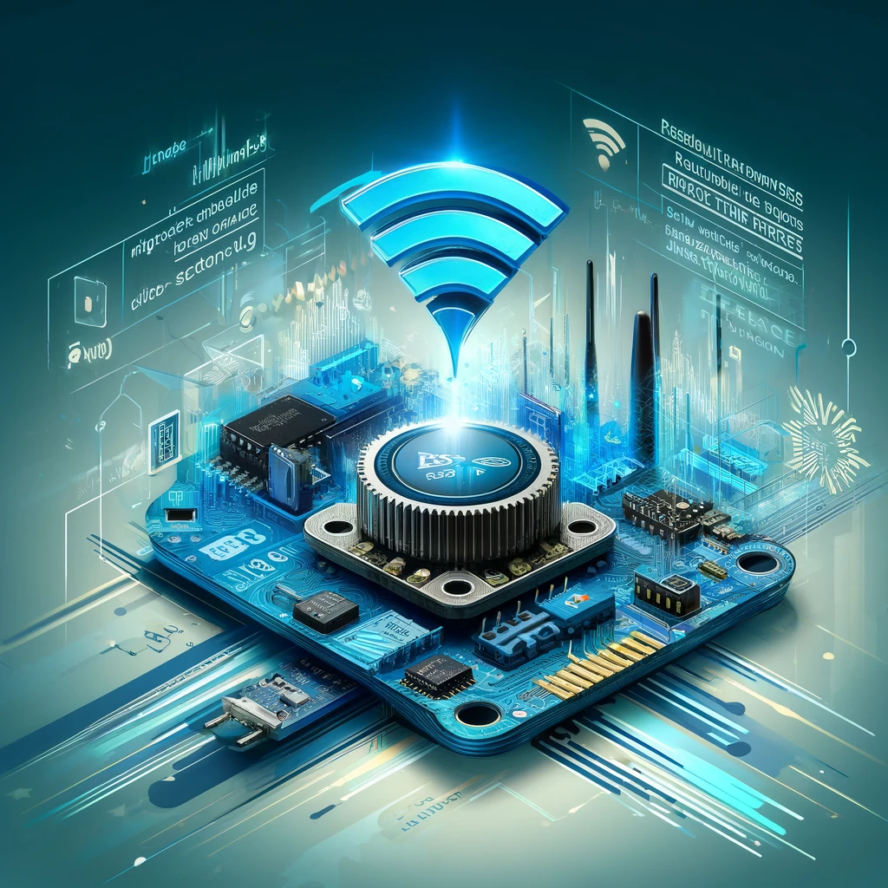

# ESP32 MCP Server

A [Model Context Protocol](https://modelcontextprotocol.io/) (MCP) implementation for ESP32 microcontrollers, providing a WebSocket-based interface for resource discovery and monitoring.

## Status: Not Compiling, initial commit as is from the model

Created with Claude 3.5 Sonet on the commit date (with minor obvioud fixes with automatic formating, etc.)



## Features

- MCP protocol implementation (v0.1.0)
- WebSocket server for real-time updates
- Resource discovery and monitoring
- WiFi configuration via web interface
- Thread-safe request handling
- Comprehensive test suite
- AsyncWebServer integration
- LittleFS support for configuration storage

## Prerequisites

### Hardware

- ESP32 S3 DevKitC-1 board
- USB cable for programming

### Software

- PlatformIO Core (CLI) or PlatformIO IDE
- Python 3.7 or higher
- Git

## Architecture

```mermaid
flowchart TD
    Start[Start Application] --> Setup[Setup]
    Setup -->|Initialize Filesystem| InitFS[Initialize LittleFS]
    Setup -->|Start Network| StartNetwork[Initialize Network Manager]
    Setup -->|Create Tasks| CreateTasks[Create and Assign Tasks]

    subgraph Network
        StartNetwork --> APCheck[Check AP or Connect Mode]
        APCheck -->|Credentials Exist| Connect[Connect to WiFi]
        APCheck -->|No Credentials| StartAP[Start Access Point]
        Connect --> NetworkReady[Network Ready]
        StartAP --> NetworkReady
    end

    subgraph MCP_Server
        MCP[Start MCP Server] --> HandleClient[Handle Client Connections]
        HandleClient --> HandleRequest[Handle Requests]
        HandleRequest -->|WebSocket Events| WebSocket[Handle WebSocket]
        HandleRequest -->|HTTP Endpoints| HTTP[Process HTTP Requests]
    end

    subgraph Metrics
        self[Start Metrics System] --> InitMetrics[Initialize System Metrics]
        InitMetrics --> CollectMetrics[Collect Metrics Periodically]
        CollectMetrics --> SaveMetrics[Save Metrics to Filesystem]
    end

    subgraph Logger
        self[Start uLogger] --> LogMetrics[Log Metrics Data]
        LogMetrics --> CompactLogs[Compact Logs if Necessary]
        CompactLogs -->|Rotates Logs| LogRotation
    end

    CreateTasks -->|Network Task| NetworkTask[Run Network Task on Core]
    CreateTasks -->|MCP Task| MCPTask[Run MCP Server Task on Core]
    NetworkTask --> Network
    MCPTask --> MCP_Server
    MCP_Server --> Metrics
    Metrics --> Logger


```

## Installation

1. Clone the repository:

```bash
git clone https://github.com/yourusername/esp32-mcp-server.git
cd esp32-mcp-server
```

2. Install dependencies:

```bash
pio pkg install
```

3. Build and upload the filesystem:

```bash
pio run -t uploadfs
```

4. Build and upload the firmware:

```bash
pio run -t upload
```

## Usage

### Initial Setup

1. Power on the ESP32. It will create an access point named "ESP32_XXXXXX"
2. Connect to the access point
3. Navigate to <http://192.168.4.1>
4. Configure your WiFi credentials
5. The device will connect to your network

### MCP Connection

Connect to the MCP server using WebSocket on port 9000:

```javascript
const ws = new WebSocket('ws://YOUR_ESP32_IP:9000');

// Initialize connection
ws.send(JSON.stringify({
    jsonrpc: "2.0",
    method: "initialize",
    id: 1
}));

// List available resources
ws.send(JSON.stringify({
    jsonrpc: "2.0",
    method: "resources/list",
    id: 2
}));
```

## Testing

Run the test suite:

```bash
# Run all tests
pio test -e native

# Run specific test
pio test -e native -f test_request_queue

# Run with coverage
pio test -e native --coverage
```

## Contributing

1. Fork the repository
2. Create your feature branch (`git checkout -b feature/amazing-feature`)
3. Commit your changes (`git commit -m 'Add amazing feature'`)
4. Push to the branch (`git push origin feature/amazing-feature`)
5. Open a Pull Request

## License

This project is licensed under the MIT License - see the [LICENSE](LICENSE) file for details.
